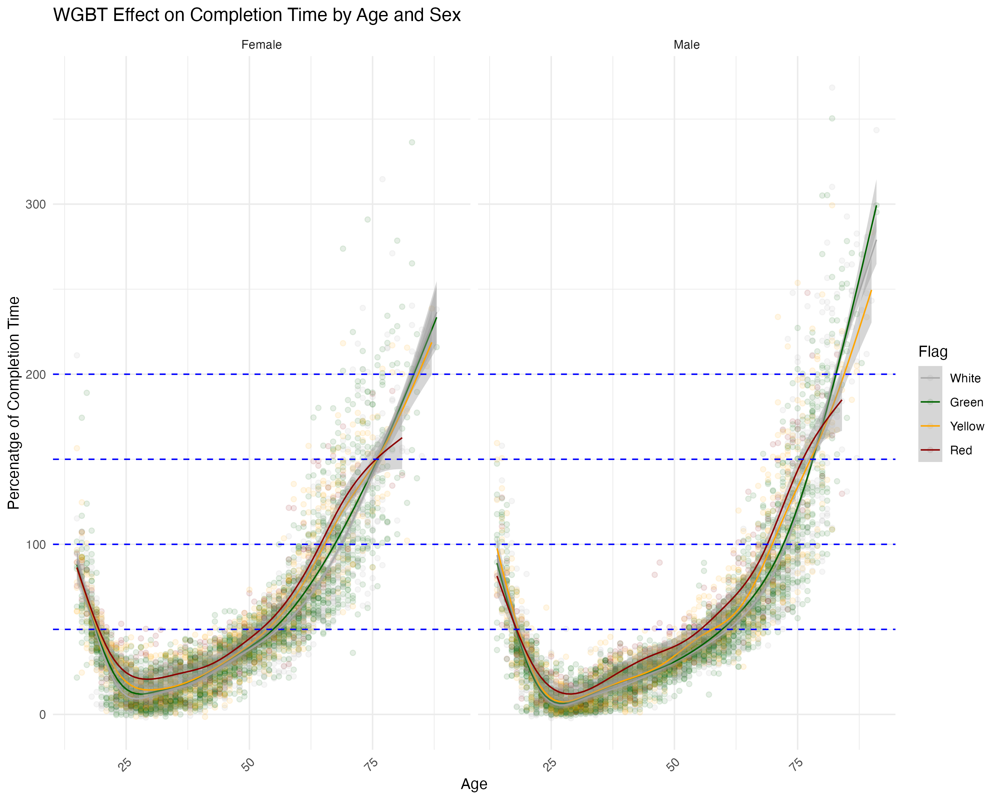

# Marathon Performance Analysis: Impact of Different Weather Conditions on Runners

## Abstract

**Purpose:** The purpose of this report is to analyze the impact of various weather conditions on marathon performance, focusing on how age, gender, and environmental factors influence race completion times. The study examines data from five major marathons to identify which factors have the most significant effects on marathon performance and whether these effects differ across age and gender.

**Methods:** The analysis employed both data visualization and linear regression models to examine the impact of inner factors (age, gender) and outer factors (weather variables such as temperature, humidity, wind, and solar radiation) on marathon completion times. Data from two datasets (Marathon Data and Course Record Data) were combined, and exploratory data analysis, including boxplots, scatter plots, and regression lines, was used to visualize trends. Linear regression models were then built to quantify the effects of each variable and their interactions, particularly focusing on the influence of age and gender across different weather conditions.

**Results:** The study found that weather conditions, particularly the Wet Bulb Globe Temperature (WBGT), significantly affect marathon performance, with higher WBGT values increasing completion times. Age and gender also influence results, with males generally outperforming females and younger runners performing better than older ones. However, the weather’s impact does not vary significantly between genders but does vary with age, with older runners being more affected.


## Demo

### General Model:
$$
\begin{aligned}
Model_{general_1} : CR_{PERCENTAGE} &= \beta_0 + \beta_1 \times RH + \beta_2 \times SR + \beta_3 \times Wind + \beta_4 \times WBGT \\
&+ \beta_5 \times Sex + \beta_6 \times Age \\
&+ \beta_7 \times RH \times Age + \beta_8 \times SR \times Age + \beta_9 \times Wind \times Age + \beta_{10} \times WBGT \times Age \\
& = \beta_0 + \beta_5 \times Sex + \beta_6 \times Age \\
&+ (\beta_1 + \beta_7 \times Age) \times RH + (\beta_2 + \beta_8 \times Age) \times SR \\
&+ (\beta_3 + \beta_9 \times Age) \times Wind + (\beta_4 + \beta_{10} \times Age) \times WBGT \\
& = -69.4308 -4.8122 \times Sex + 2.5651 \times Age \\
&+ (0.2727 -0.0063 \times Age) \times RH + (0.0434 -0.0011 \times Age) \times SR \\
&+ (-0.3553 + 0.0071 \times Age) \times Wind + (0.6903 -0.0034 \times Age) \times WBGT
\end{aligned}
$$

| Coefficient    | Estimate    | Std. Error | t value   | Pr(>|t|)  |
|-------------|------------|-----------|-----------|-----------|
| (Intercept) | -69.4308723| 4.5839555 | -15.146498| 0.0000000 |
| RH          | 0.2727244  | 0.0307757 | 8.861691  | 0.0000000 |
| SR          | 0.0434054  | 0.0054814 | 7.918591  | 0.0000000 |
| Wind        | -0.3553057 | 0.2213215 | -1.605383 | 0.1084381 |
| WBGT        | 0.6903328  | 0.1663000 | 4.151129  | 0.0000333 |
| SexMale     | -4.8122171 | 0.6008163 | -8.009464 | 0.0000000 |
| Age         | 2.5651730  | 0.0913176 | 28.090689 | 0.0000000 |
| RH:Age      | -0.0063505 | 0.0006135 | -10.352104| 0.0000000 |
| SR:Age      | -0.0011180 | 0.0001099 | -10.171410| 0.0000000 |
| Wind:Age    | 0.0071830  | 0.0043962 | 1.633892  | 0.1023100 |
| WBGT:Age    | -0.0034103 | 0.0033647 | -1.013528 | 0.3108302 |

### Figures




## Files

The structure of the project is as follows:

> **Warning:** The data used in this project is not included in this repository.

```bash
impact-weather-marathon-performance
├── Data
│   ├── Marathon Data Codesheet.docx
│   ├── aqi.R
│   ├── aqi_values.csv
│   ├── course_record.csv
│   ├── marathon_dates.csv
│   └── project1.csv
├── Plots
│   ├── age_effect_plot.png
│   ├── completion_time_race.png
│   ├── cor_plot.png
│   ├── cr_distribution_plot.png
│   ├── missing_values_plot.png
│   ├── participants_age_plot.png
│   ├── rh_effect.png
│   ├── sex_distribution_race.png
│   ├── sr_effect.png
│   ├── weather_effect.png
│   ├── wgbt_effect.png
│   └── wind_effect.png
├── README.md
├── Report
│   ├── report.Rmd
│   └── report.pdf
├── LICENSE
└── Marathon Data Talk Brown University.pptx
```
All of the code are in `Report/report.Rmd` and the plots generated from the code are in `Plots/` folder.